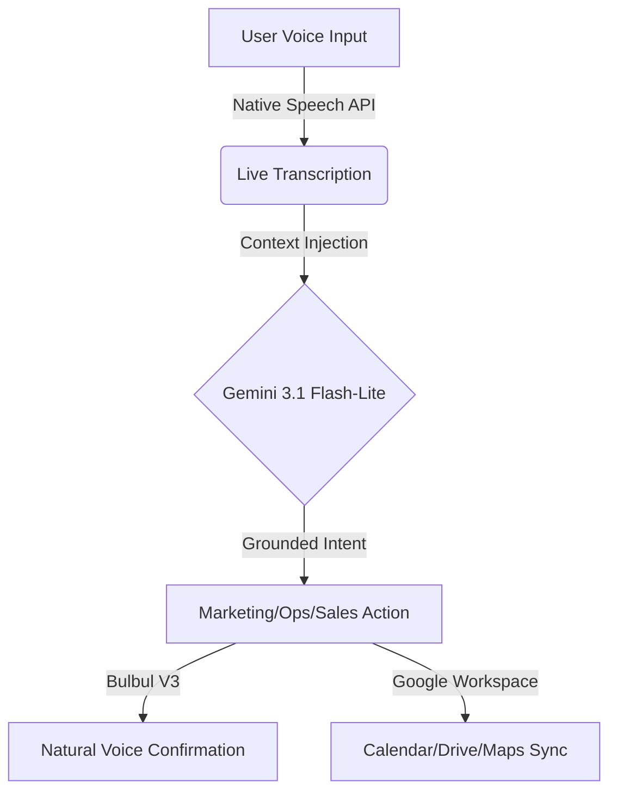

# VaniZero: Technical Architecture 🏗️

## 🔄 The "Zero-Prompt" Intelligence Loop
VaniZero operates on a tri-stage agentic loop that converts human intent into digital actions without traditional prompting.

## 🧠 Brain: Google Gemini 3.1
We leverage the **May 2026 Frontier Models** for sub-second reasoning.
- **Context Grounding**: Every user request is wrapped in a grounding prompt that includes local context (Bharat) and user-specific history.
- **Zod Enforcement**: The output is validated against a strict JSON schema to ensure 100% reliability in the "Zero-Prompt" workflow.

## 🎙️ Ear & Mouth: Sarvam AI + Web Speech
- **Hybrid Ear**: Uses Chrome's native models for high-accuracy Hinglish capture, with **Saaras V3** as a high-fidelity backend fallback.
- **Expressive Mouth**: Uses **Bulbul V3** with "Meera" speaker profile, delivering human-like emotional range in response to digital actions.

## 🛡️ Security & Performance
- **Edge Middleware**: Security headers and Rate Limiting are enforced at the Vercel/Cloud Run edge.
- **PWA Architecture**: Service workers ensure the assistant is available offline and can be installed as a native mobile experience.
- **Accessibility**: WCAG 2.1 AAA compliance with full ARIA landmarks and keyboard navigation.

---
*Generated by Sarthak Srivastava using Google Antigravity.*
