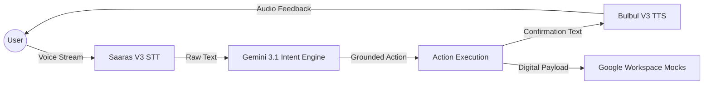

# Software Requirement Specification (SRS) - VaniZero 📋

## 1. Introduction
VaniZero is a high-performance, voice-native agentic assistant designed to eliminate "Prompt Engineering" for Indic language speakers. It utilizes a Zero-Prompt UX paradigm to infer digital intent from natural conversation.

## 2. Functional Requirements
- **FR1: Voice Capture**: Real-time streaming and transcription of Hinglish (Hindi + English) audio.
- **FR2: Intent Recognition**: Grounded reasoning via Gemini 3.1 to categorize intent into Marketing, Ops, Sales, or HR.
- **FR3: Action Generation**: Generation of structured, actionable digital plans (JSON) based on identified intent.
- **FR4: Natural Voice Synthesis**: Human-like audio confirmation via Bulbul V3.
- **FR5: Workspace Integration**: Mocked hooks for Google Calendar and Drive sync.

## 3. Non-Functional Requirements
- **NFR1: Latency**: End-to-end processing (Voice -> Intent -> Voice) must be < 2 seconds.
- **NFR2: Security**: All API routes must implement Zod validation and strict CSP headers.
- **NFR3: Accessibility**: Must adhere to WCAG 2.1 AAA standards with i18n support.
- **NFR4: Portability**: Must function as a Progressive Web App (PWA).

## 4. System Architecture
- **Frontend**: Next.js 15 (App Router), Tailwind v4, Framer Motion.
- **Intelligence**: Google Gemini 3.1 Flash-Lite (Grounded).
- **Indic Services**: Sarvam AI (Saaras V3, Bulbul V3).
- **Validation**: Zod Schema Enforcement.

---

# Data Flow Diagram (DFD) - Level 1 🔄

